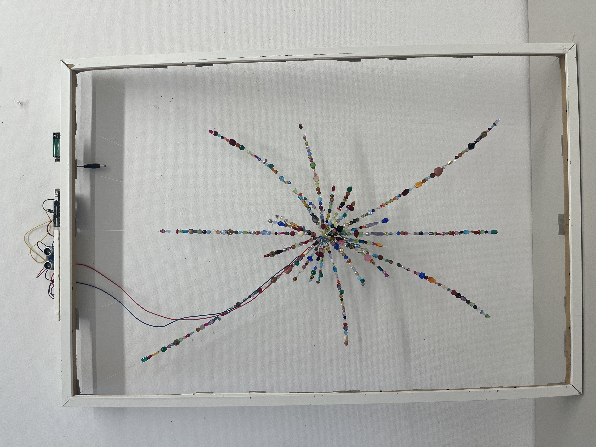

# Cyclosa Spider Defense Tactic Re-creation

This project is a kinetic art installation that recreates the unique defense tactic of the *Cyclosa* spider. In nature, the spider collects debris in its web and meticulously arranges it into a "decoy" that mimics the shape of a larger spider. When threatened, the *Cyclosa* vibrates its abdomen, causing the decoy to move and appear alive, distracting potential predators.

The sculpture is constructed with a wooden frame, beads, and string to interpret this biological phenomenon. This "debris decoy" is brought to life using vibration motors triggered by an ultrasonic distance sensor. As a viewer approaches, the sensor detects their proximity, activating the motors and causing the beaded structure to shimmer and move—mirroring the spider's own defensive behavior in response to the environment.

## Ultrasonic Vibration Motor Controller (Direct PWM)

This project uses an Arduino Uno, a transistor-based motor driver, and an HC-SR04 ultrasonic sensor to control a vibration motor. The vibration intensity is mapped to the distance measured by the sensor.

## Features
- Direct PWM control (no shield required).
- Proportional feedback: Vibration strength increases as objects get closer.
- Detection range: 5cm (max vibration) to 50cm (min vibration).

## Hardware Requirements
- Arduino Uno
- NPN Transistor (e.g., PN2222, 2N3904)
- 1kΩ Resistor
- 1N4001 Diode (Flyback protection)
- HC-SR04 Ultrasonic Sensor
- Mini Vibration Motor

## Wiring

### 1. Vibration Motor (via Transistor)
| Component | Connection A | Connection B |
| :--- | :--- | :--- |
| **1kΩ Resistor** | Arduino Pin 3 (PWM) | Transistor Base |
| **Transistor** | Emitter | Arduino GND |
| **Transistor** | Collector | Motor (-) Wire |
| **Motor** | Motor (+) Wire | Arduino 5V |
| **Diode** | Anode (no stripe) | Motor (-) |
| **Diode** | Cathode (stripe) | Motor (+) |

### 2. Ultrasonic Sensor (HC-SR04)
| Sensor Pin | Arduino Pin |
| :--- | :--- |
| **VCC** | 5V |
| **Trig** | Pin 9 |
| **Echo** | Pin 10 |
| **GND** | GND |

## Usage
1. Open the project in VS Code with PlatformIO.
2. Connect your Arduino Uno via USB.
3. Build and Upload the code.
4. Use the Serial Monitor (115200 baud) to view distance readings.
